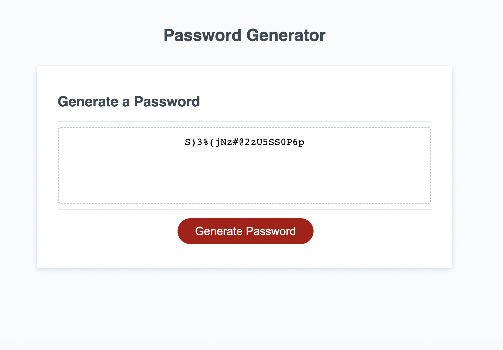

# Password-Generator

https://daveym1.github.io/Password-Generator/

## Description

A password generator built using JavaScript. When the generate password button is clicked, a series of prompt ask the user to choose some options for their password. After the prompts their password is displayed in the text box.

With JavaScript I learnt how to iterate through the different arrays and using the prompts from the user, choose random characters from each array and put them into a password variable which is then displayed in the HTML form.

## Screenshot

